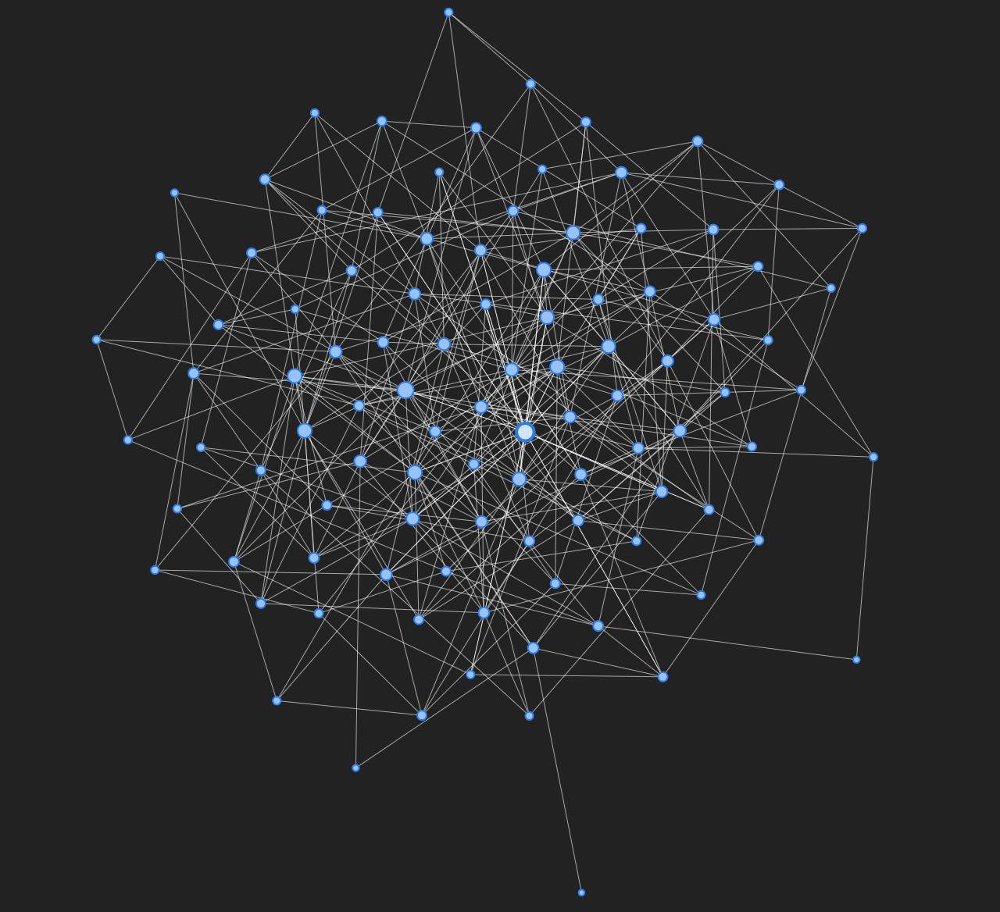
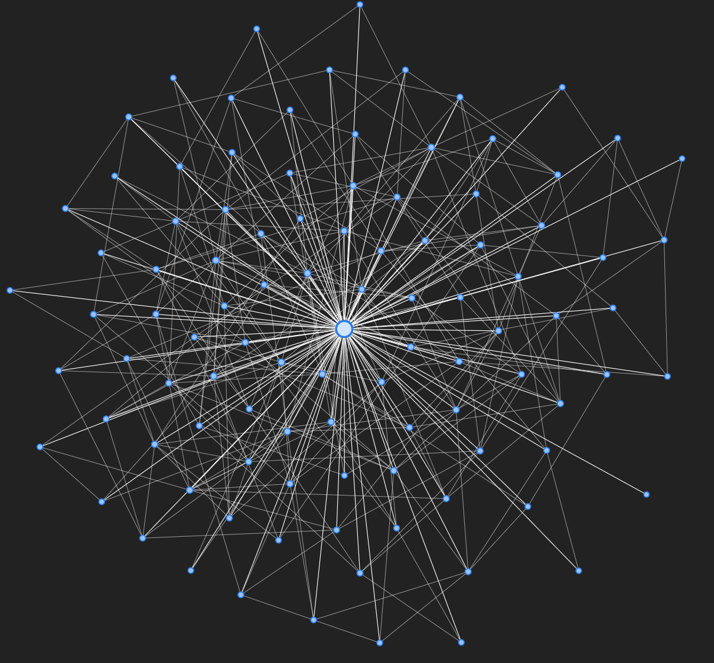
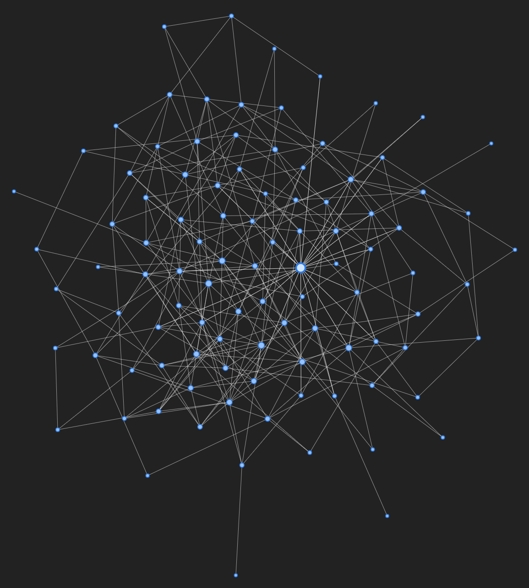
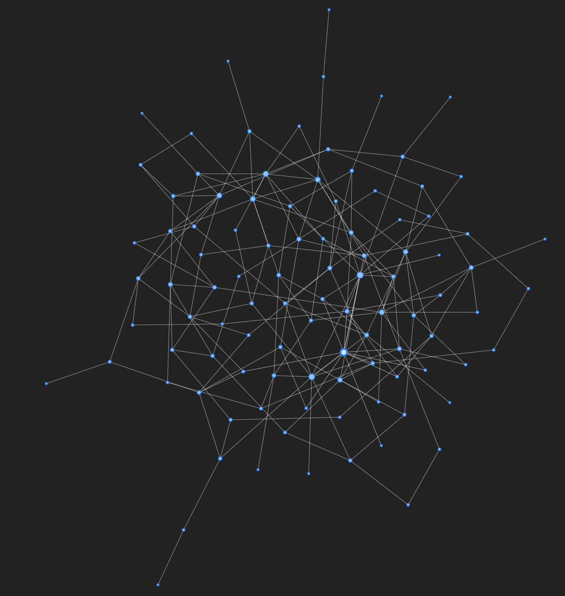
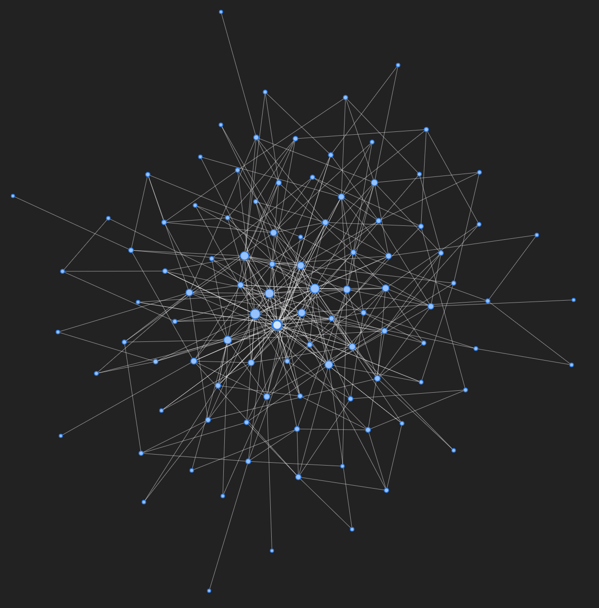

# Description for the Preferential Attachment Functions

## preferntialAttachmentV1

This model follows the Barabási–Albert model which uses a linear preferential attachment. The detail can be found here: https://en.wikipedia.org/wiki/Barab%C3%A1si%E2%80%93Albert_model

```python
def preferentialAttachmentV1(max_nodes, loner=False):
    G = nx.Graph()
    G.add_node(0)
    G.add_node(1)
    G.add_edge(0, 1)
    p = 0.5
    # ----- Part 1 -----
    for i in range(2, max_nodes):
        # ----- Part 1.1 -----
        node_list = sorted(node for (node, val) in sorted(G.degree, key=lambda x: x[1], reverse=True))
        G.add_node(i)
        # ----- Part 1.2 -----
        for j in node_list:
            if G.number_of_edges() != 0:
                p = G.degree(j) / (2 * G.number_of_edges())
            if (round(np.random.uniform(0, 1), 1) < p):
                G.add_edge(j, i)
        # ----- Part 1.3 -----
        if not loner & (G.degree[i] == 0):
            tmp = node_list[random.choice(node_list)]
            G.add_edge(tmp, i)
    plotGraph(G)
    return (G)
```
### Basic Description:
User defines the maximum number of nodes in the final graph (max_nodes) as well as whether loner behavior should be exhibited (refer to *Part 1.3*). The Function then returns a preferential attachment (*PA*) graph.

#### Part 1
```python
for i in range(2, max_nodes):
```
The loop will run $(max\_nodes - 2)$ times, omitting nodes 0 and 1 because they are already initialized.
#### Part 1.1
```python
node_list = sorted(node for (node, val) in sorted(G.degree, key=lambda x: x[1], reverse=True))
G.add_node(i)
```
We first obtain a list of existing nodes sorted by degrees in descending order, then we add the new $node_i$ into the graph

#### Part 1.2
```python
for j in node_list:
    if G.number_of_edges() != 0:
        p = G.degree(j) / (2 * G.number_of_edges())
    if (round(np.random.uniform(0, 1), 1) < p):
        G.add_edge(j, i)
```
Now we loop through the list of existing nodes excluding $node_i$ (node_list) and calculate the probability p that the new $node_i$ will form an edge with the current existing node.
Probability $p_i$ that new $node_i$ will appending to existing $node_j$ is calculated as follows:
$$
\begin{align*}
p_i = \frac{k_i}{\sum_j k_j}\label{ref1}
\end{align*}
\\
$$
Once we have calculated the probability, we used the numpy's random.uniform() function to get a random float between [0,1] and compare that with $p_i$. If the random float is smaller than $p_i$, we connect $node_i$ with $node_j$.

#### Part 1.3

```python
if not loner & (G.degree[i] == 0):
    rand_node = node_list[random.choice(node_list)]
    G.add_edge(rand_node, i)
```

This is the loner behavior of the graph. If $loner == False$ , $node_i$ will connect to a random existing node in the graph if it did not form an edge with $node_j$ in *Part 1.2*. We found that the method we use to select the random node has significant effect on the final graph. In the following section we will discuss the results of different selection methods using the following parameters:

```python
preferentialAttachmentV1(100, False)
```

### Discussion of different random node selection methods for *Part 1.3*

#### 1. Randomly select a node from node_list using random.choice():

```python
if not loner & (G.degree[i] == 0):
    rand_node = node_list[random.choice(node_list)]
    G.add_edge(rand_node, i)
```

The result from this method is shown below:



The highlighted node in the middle is $node_0$ , and as you can see its degree isn't very different from other nodes (the size of the node represents its relative degree).

#### 2.  Simply choose the most connected node:

```python
if not loner & (G.degree[i] == 0):
    rand_node = node_list[0]
    G.add_edge(rand_node, i)
```



The highlighted node is $node_0$ and its degree is significantly higher than other nodes. 

#### 3. Repeat Part 1.2 until $G.degree[node_i] \ne 0$:

```python
while(G.degree[i] == 0):
    for j in node_list:
        if G.number_of_edges() != 0:
            p = G.degree(j) / (2 * G.number_of_edges())
        if (round(np.random.uniform(0, 1), 1) < p):
            G.add_edge(j, i)
```



Note that the result from this method is similar to that of random.choice()

## preferentialAttachmentV2()

The second version of PA adds one parameter to the function: *max_p*.

The codes are identical with the exception to the following part:

#### Part 1.2 

```python
for node, degrees in node_list:
    if (G.degree(node) / (2 * G.number_of_edges())) >= max_p:
        p = max_p
    else:
        p = G.degree(node) / (2 * G.number_of_edges())
        if random.random() <= p:
           	G.add_edge(node, i)
```

We found that by setting the *max_p* to a low value (e.g. 0.2), no single node will have significantly higher degree than other nodes:

```python
preferentialAttachmentV2(100, loner=False, max_p=0.2)
```

The above function generated the following:



## preferentialAttachmentV3() 
In this version we focus on methods to tweak $p_i$. As a result of the formula : $p_i = \frac{k_i}{\sum_j k_j}$, we found that $p_i$ is quite small for most nodes except for the initial few. Nevertheless, we did not find a suitable function for $p_i$ yet. Ideally we would like to find a function that ranges between 0 and 1 and exhibits exponential properties. 

 Here are the changes made to V3:

```python
# ----- Part 1.2 -----
count = max_nodes
for j in node_list:
    p = G.degree(j) / (2 * G.number_of_edges())
    p = p + p * (1 - (1/(count+1)))
    if random.random() <= p:
        G.add_edge(j, i)
        count -= 1
```

The function $f(x) = 1 - (\frac{1}{count + 1})$ exhibits the following features: 

- $x = 1, f(x) = 0.5$
- as $x \rightarrow infinity, f(x) \rightarrow 1$

We believe this change will increase the number of KOLs in the network as it boosts $p_i$ for more connected nodes:

